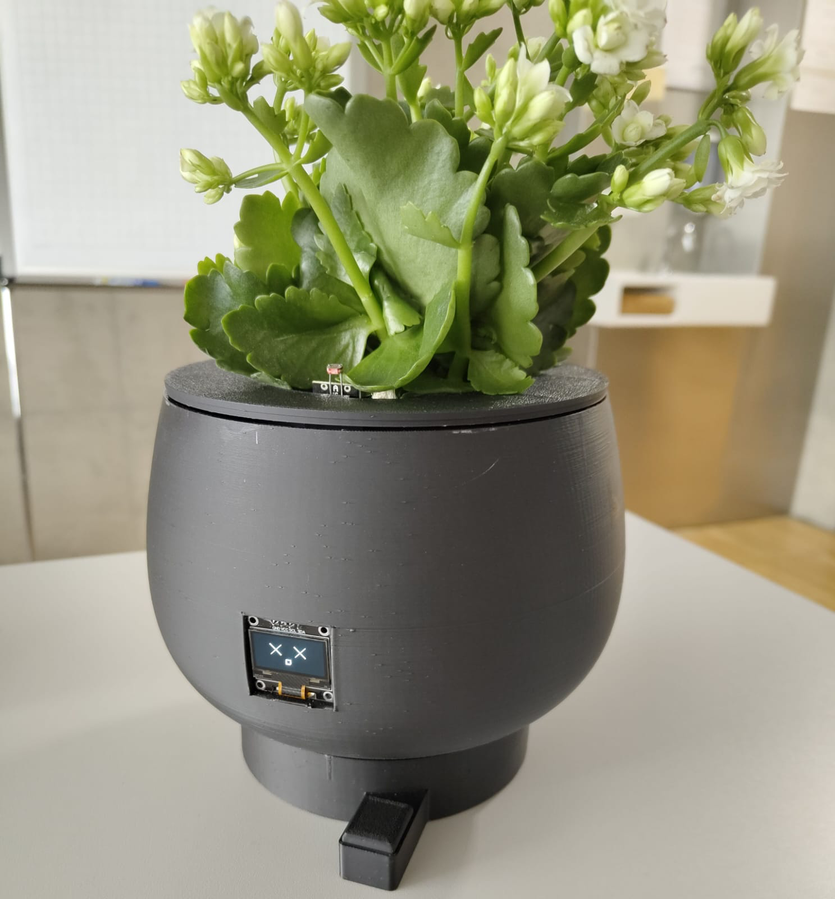
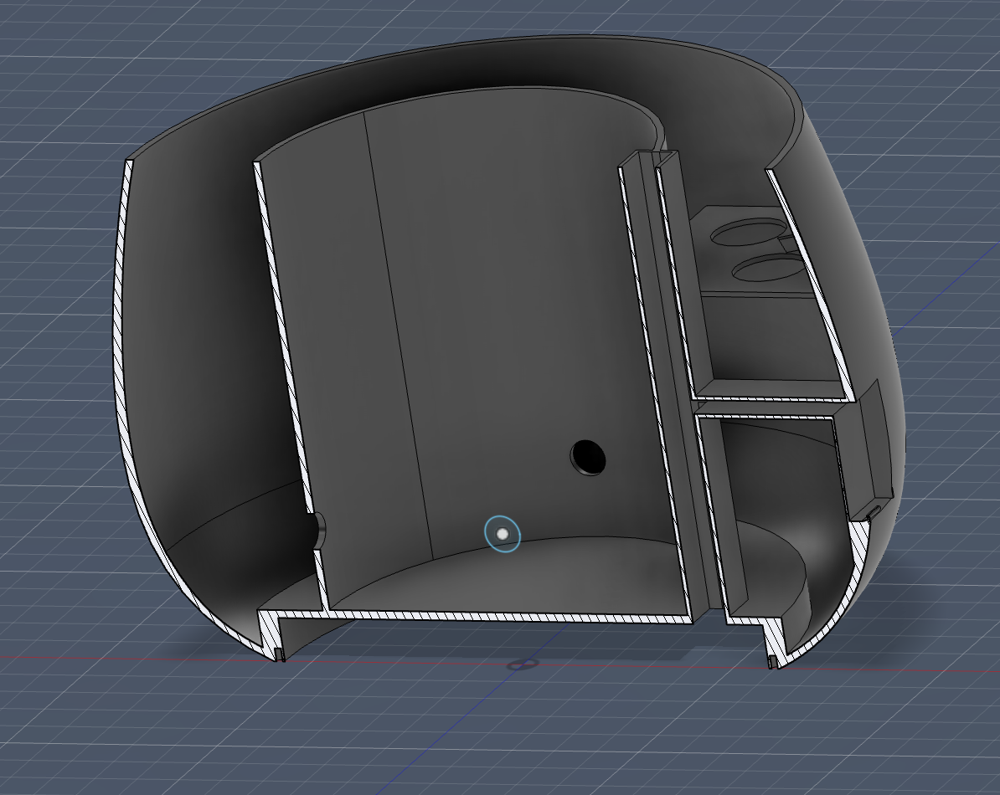
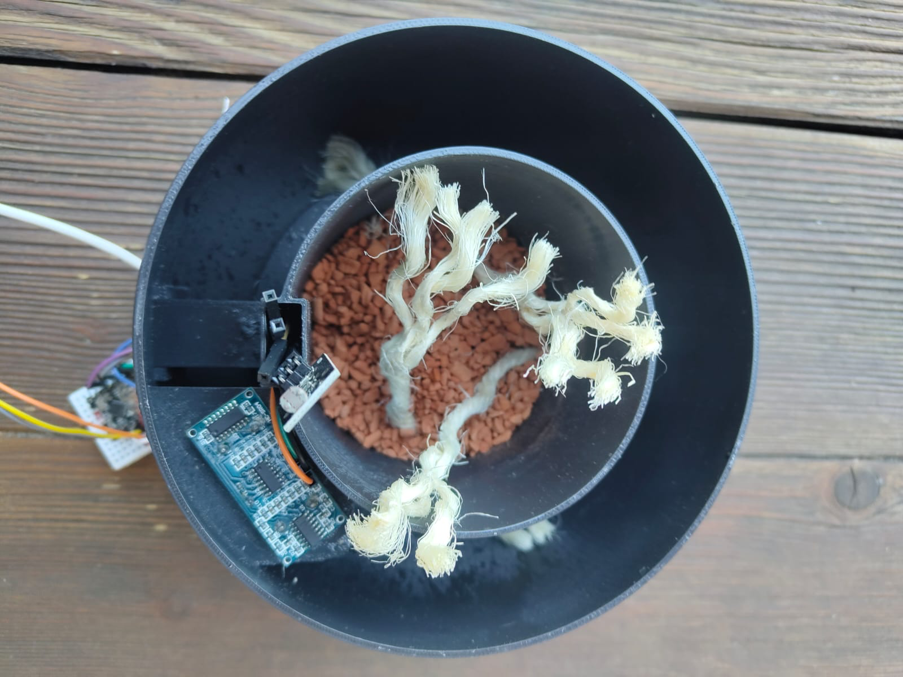
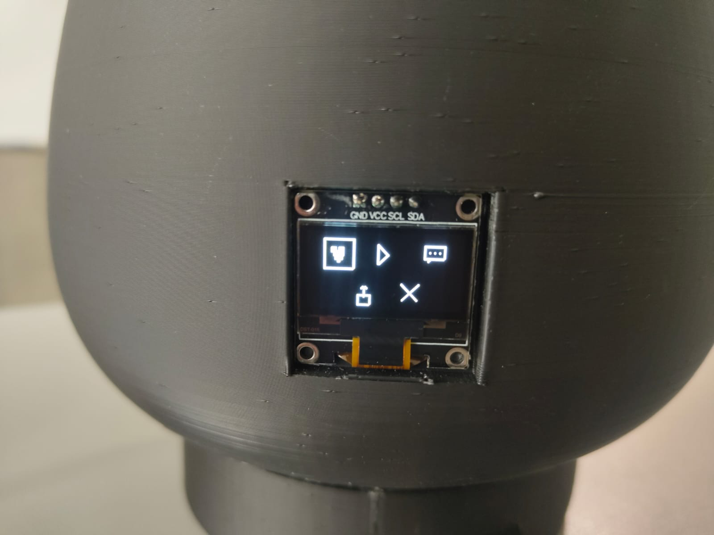
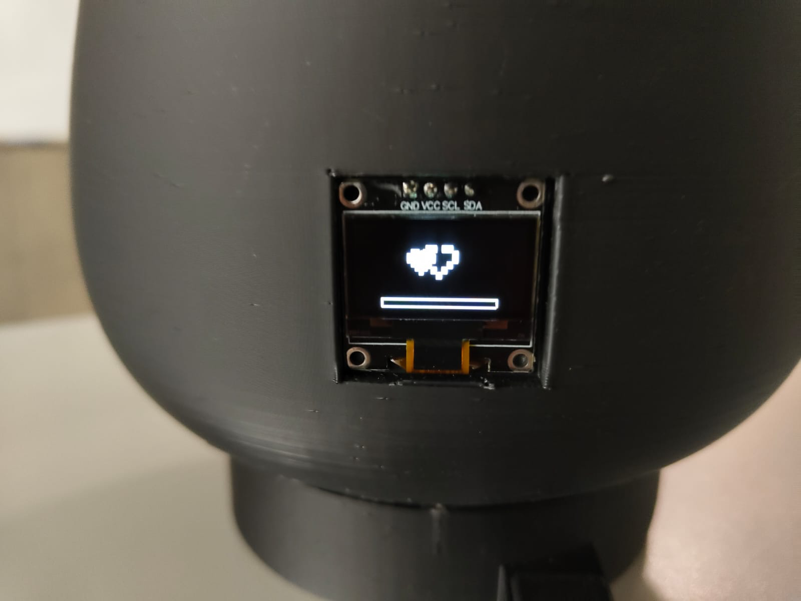
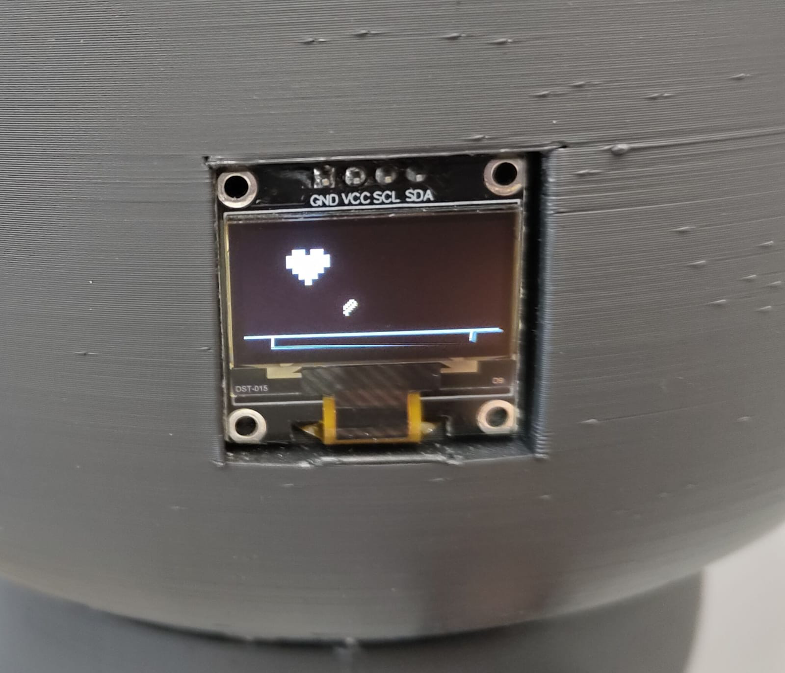

# Happy Plant

## Projektbeschreibung

Happy Plant soll dabei helfen Pflanzenpflege einfach und interaktiv mit Spaßfaktor zu gestalten. Die Pflanze teilt dabei ihre Gefühle, also ihren aktuellen Zustand mit. Diesen misst sie mit Hilfe von verschiedenen Sensoren. 

Das Ziel des Projekts ist die Verbindung von Embedded Systems, Sensorik und spielerischer Benutzerinteraktion.

---

## Hardware

Verwendete Komponenten:

* ESP32-C3 Super Mini
* SSD1306 OLED Display (I²C)
* HC-SR04 Ultraschallsensor
* Helligkeitssensor
* Knopd
* 3D-gedruckter Pflanzentopf

### Sensorik

Die Sensorik dient dazu den Gefühlzustand der Pflanze festzustellen

#### Wasserstand

Der Wasserstand wird über einen HC-SR04 Ultraschallsensor ermittelt. Gemessen wird der Abstand zur Wasseroberfläche im integrierten Wassertank.

#### Licht

Ein Helligkeitssensor erfasst die aktuelle Umgebungshelligkeit. Die Bewertung erfolgt abhängig von der Uhrzeit (Tag oder Nacht).

## Softwarearchitektur

Die Software ist modular aufgebaut.

### Module

* `plant.c` – Zustandsautomat (FSM)
* `plant_faces.c` – Darstellung der Gesichter
* `interaction.c` – Menüsystem
* `thoughts.c` – Gedanken und Texte
* `pet_game.c` – Streichel-Minispiel
* `play_game.c` – Jump-and-Run-Minispiel
* `ultrasonic.c` – Wasserstandsmessung
* `light_sensor.c` – Helligkeitserfassung
* `plant_clock.c` – Uhrzeitverwaltung

## Zustände der Pflanze

Die Pflanze besitzt mehrere Gefühlzustände:
* glücklich
* liebevoll
* durstig
* traurig
* verachtend
* tot

Sie werden auf dem Display durch verschiedene Gesichter dargestellt.
Die Zustände werden nach folgender Priorität bestimmt:

1. Wasserstand
2. Lichtbedingungen
3. Zufriedenheit

## Der Topf

Der Pflanzentopf wurde mit PLA 3D-Gedruckt und zusätzlich mit Acryllack innen abgedichtet.

### Aufbau
Er ist doppelwandig und verfügt daher über einen Wassertank, der mit Hilfe des Ultraschallsensors überwacht wird.
Das Display ist auf der Vorderseite eingelassen.
Der Knopf befindet sich unter dem Display am Boden.

### Dorchtsystem
Der Topf beruht auf dem Dorchtsystem:
Es können nur pflanzen eingepflanzt werden, die es gerne feucht haben. Die Erde wird komplett entfernt, sodass nur noch die Wurzeln vorhanden sind und statt normaler Erde wird der Topf mit Granulat aufgefüllt. Dazwischen liegen Dorchte die mit dem Wassertank verbunden sind. Die Kappilarwirkung sorgt dafür, dass das Wasser zu den Wurzeln der Pflanze transportiert wird.

### Wasserbewertung

| Abstand | Zustand  |
| ------- | -------- |
| ≤ 3 cm  | Voll     |
| ≤ 5 cm  | Niedrig  |
| ≤ 6 cm  | Kritisch |
| > 6 cm  | Leer     |

### Lichtbewertung

Tagsüber:

* Lichtwert < 700 → genügend Licht
* Lichtwert ≥ 700 → zu wenig Licht

Nachts:

* Lichtwert > 1500 → dunkel genug
* Lichtwert ≤ 1500 → zu hell

## Interaktionen

Über einen Knopf kann ein Menü geöffnet werden.
Dabei stehen folgende Aktionen zur Verfügung:

* Streicheln
* Spielen
* Gedanken anzeigen
* Statusanzeige 
* Menü verlassen

## Minispiele

### Streicheln

Ein Herz, dass sich von links nach rechts bewegt, muss durch richtiges Timing in einem Herzrahmen gestoppt werden. Sobald 4 Treffer erfolgt sind, erhöht sich die Zufriedenheit der Pflanze.

### Jump and Run

Der Spieler steuert ein Herz, das Hindernissen ausweichen muss. Die erreichte Punktzahl wird in Zufriedenheit umgewandelt.

## Gedankenfunktion

Die Pflanze äußert abhängig von ihrem aktuellen Zustand verschiedene Texte/Kommentare.

Beispiele:

* "WASSER IST EIN GERUECHT."
* "INTERESSANTE PFLEGE."
* "BANANEN SIND BEEREN."

Dadurch wird der Charakter der Pflanze unterstrichen.

## Statusanzeige

Die Statusansicht zeigt aktuelle Sensordaten:

* Wasserstand
* Helligkeitswert
* Zufriedenheit

## Autor

Projekt im Rahmen des Moduls Embedded Systems von Norah-Chantal Schuchter.
